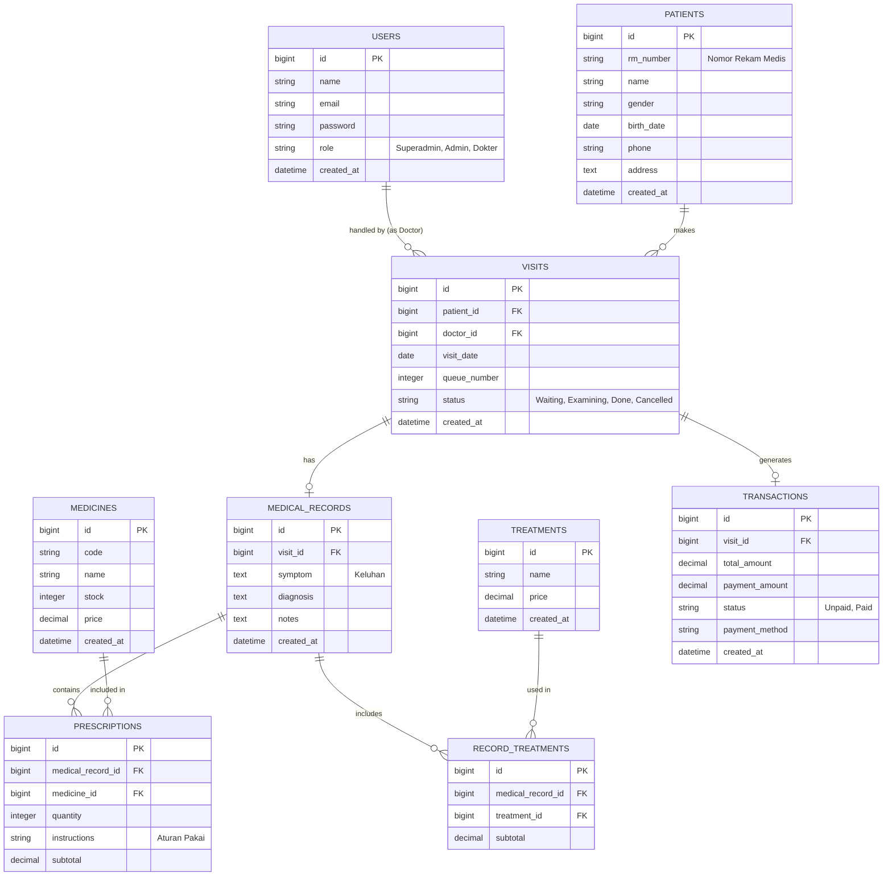

# Product Requirements Document (PRD): Sistem Manajemen Klinik

## 1. Pendahuluan
### 1.1 Tujuan Dokumen
Dokumen ini berfungsi sebagai panduan utama (Single Source of Truth) bagi tim pengembang, desainer, dan pemangku kepentingan (stakeholders) dalam membangun **Sistem Manajemen Klinik**. Dokumen ini mendefinisikan visi produk, kebutuhan fungsional dan non-fungsional, serta arsitektur data.

### 1.2 Latar Belakang
Klinik saat ini masih menggunakan pencatatan manual untuk data pasien, rekam medis, dan transaksi. Hal ini menyebabkan lambatnya proses pelayanan, risiko kehilangan data, dan kesulitan dalam pelaporan. Sistem ini dibangun untuk mendigitalisasi dan mengotomatisasi proses bisnis klinik.

### 1.3 Ruang Lingkup
Sistem akan berbasis web yang mengelola siklus pelayanan klinik mulai dari pendaftaran pasien, pemeriksaan (rekam medis), hingga pembayaran dan pelaporan.

---

## 2. Target Pengguna (User Personas)
1. **Superadmin / Pemilik Klinik**: Mengelola data master (obat, layanan), pengguna (dokter, admin), pengaturan aplikasi, dan melihat laporan keuangan/operasional secara keseluruhan.
2. **Admin / Resepsionis**: Mendaftarkan pasien baru, mengelola antrian harian, dan melayani pembayaran (kasir).
3. **Dokter**: Memeriksa antrian pasien, melihat riwayat pasien, dan mengisi rekam medis (diagnosa, resep obat, tindakan).

---

## 3. Kebutuhan Fungsional (Functional Requirements)

### 3.1 Modul Otentikasi & Manajemen Pengguna
- Login dan Logout berbasis Role (Superadmin, Admin, Dokter).
- CRUD Pengguna dan profil.

### 3.2 Modul Master Data
- **Pasien**: Pendaftaran data demografi pasien.
- **Obat**: Manajemen stok, harga, dan kategori obat.
- **Tindakan/Layanan**: Manajemen tarif jasa pemeriksaan atau tindakan medis.

### 3.3 Modul Pelayanan & Antrian
- Pendaftaran kunjungan pasien untuk tanggal tertentu.
- Sistem nomor antrian otomatis berdasarkan poli/dokter.

### 3.4 Modul Rekam Medis (EMR)
- Pencatatan anamnesis, diagnosa (ICD-10 opsional), dan catatan dokter.
- Input resep obat dan tindakan yang diberikan kepada pasien.

### 3.5 Modul Pembayaran (Kasir)
- Perhitungan total biaya otomatis (Jasa Dokter + Tindakan + Obat).
- Cetak struk/invoice pembayaran.

### 3.6 Modul Laporan
- Laporan pendapatan klinik harian/bulanan.
- Laporan jumlah kunjungan pasien.

---

## 4. Skema Data & Arsitektur

### 4.1 Penjelasan Naratif
Arsitektur database dirancang relasional untuk memastikan integritas data. Berikut adalah entitas utama dalam sistem:
- **Users**: Menyimpan data pengguna aplikasi (Admin, Dokter, Superadmin). Dokter direlasikan ke tabel ini.
- **Patients (Pasien)**: Menyimpan data rekam medis dasar pasien (No RM, Nama, TTL, Alamat).
- **Medicines (Obat)**: Menyimpan katalog obat, stok, dan harga.
- **Treatments (Tindakan)**: Menyimpan master jasa dan tindakan medis beserta tarifnya.
- **Visits (Kunjungan/Antrian)**: Mencatat setiap kedatangan pasien, menghubungkan pasien dengan dokter pada tanggal tertentu, serta menyimpan status antrian (Menunggu, Diperiksa, Selesai).
- **Medical_Records (Rekam Medis)**: Inti dari sistem klinis. Terhubung dengan `Visits`. Menyimpan diagnosa, keluhan, dan catatan pemeriksaan.
- **Prescriptions (Resep Obat)**: Tabel pivot/detail yang menghubungkan Rekam Medis dengan Obat yang diberikan, beserta jumlah dan aturan pakainya.
- **Record_Treatments (Tindakan Medis)**: Tabel pivot/detail yang menghubungkan Rekam Medis dengan Tindakan yang dilakukan dokter.
- **Transactions (Transaksi)**: Terhubung dengan Kunjungan. Menyimpan rincian total pembayaran pasien.

### 4.2 Visualisasi ERD

---

## 5. Kebutuhan Non-Fungsional (Non-Functional Requirements)
1. **Keamanan**: Password di-hash menggunakan Bcrypt. Menerapkan proteksi CSRF dan XSS. Pembatasan hak akses berbasis Role-Based Access Control (RBAC).
2. **Performa**: Respon antarmuka yang cepat menggunakan optimasi query database. Datatables direkomendasikan menggunakan SSR (Server-Side Rendering) untuk data berjumlah besar.
3. **Ketersediaan**: Sistem beroperasi secara reliabel untuk mendukung jam operasional klinik.
4. **Auditability**: Kemampuan menelusuri riwayat perubahan data krusial seperti rekam medis.

---

## 6. Milestone Pengembangan
- **Fase 1**: Setup Proyek, Template, Otentikasi, dan Master Data (Pasien, Obat, Tindakan).
- **Fase 2**: Modul Pendaftaran Antrian Kunjungan Pasien.
- **Fase 3**: Modul Rekam Medis (Pemeriksaan oleh Dokter).
- **Fase 4**: Modul Kasir & Transaksi Pembayaran.
- **Fase 5**: Modul Laporan dan Ekspor PDF. UAT (User Acceptance Testing) dan Deployment.
